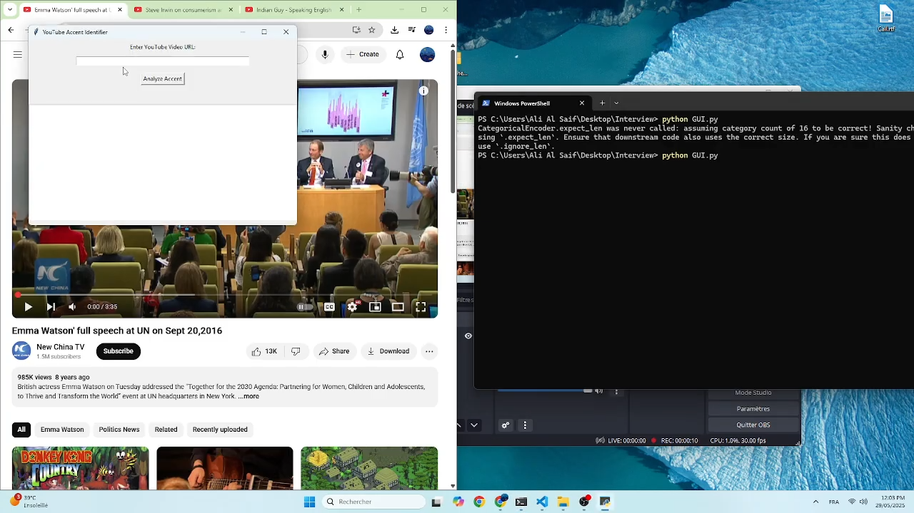

# 📽️ Demo

# Problem Statement:

## Objective:
Build a working script or simple tool that can do the following:
1. Accept a public video URL (e.g., Loom or direct MP4 link).
2. Extract the audio from the video.
3. Analyze the speaker’s accent to detect English language speaking candidates. 
Output:
  - Classification of the accent (e.g., British, American, Australian, etc.)
  - A confidence in English accent score (e.g., 0-100%)
  - A short summary or explanation (optional)

## Assumptions:
Task requires proof of concept solution, therefore, solution will be constrained under limited constraints that meet the objective requirement as a Proof-of-Concept of a producable working solution

1) Solution will provide the feature to download and analyze Youtube videos, therefore it will be constrained on URLs from Youtube only.
2) Solution will analyze a limited number of English accents (Namely: english,american,australian, indian, irish, african, malaysian, kiwi, south atlantic, bermuda, filipino, chinese, welsh and singaporean)

## Solution:
### Installation Steps:

1) Download the code in local machine, and store it in a folder.
2) Install python 3.9 ( if not already installed)
3) Create virtual environment ( in cmd type: python3.9 -m venv myenv) 
4) Navigate to /Scripts and activate the virtual environment
5) Navigate back to main folder and type the following command on the commandline: pip install -r requirements.txt
6) Run the following command on commandline( cmd) after activating the environment: python GUI.py
7) Enjoy !!

## Technicial Details:
### The Solution consists of two modules:
1) GUI ( Made with tkinter)
2) The Accent classifer model: used brainspeech library with Jzuluaga's model. ( The fastest and least resource consuming way of implementing the solution under the requirements)

#### Limitations of model performance and ways of implementing a better solution:
From the DEMO video, the model seems to do the job in giving the right classifications, however the confidence in it's classification could be considered __limited__ and there are ways of __improving it__:

The provided solution is the best solution in terms of meeting the task objectives and limiting the consumption of resources, however it's not the best solution in terms of model performance in confidence of classification accuracy.

__The solution for the best model__ in confidance accuracy: Implementation of __Wav2Vec__ + __Mozilla  common voice__ library

__cost__: Model fine-tuning requires more performance power than a single desktop pc, Mozilla common voice __english__ library is atleast 80GB worth of data, so dataset is huge and needs space and training)

__A middle-compromised solution optimized for the resources available__: Fine-tuning a __distilled__ version of Wac2Vec + __Streaming__ the Common Voice Dataset until reaching a certain specified number of labeled entries of accents( e.g. 10k or keeping it streaming the download for several hours or however many hours are available to be allocated on this solution).

if Wav2Vec + Mozilla Common Voice weren't satisfactory, one path could be explored is to buy/extract more accent data and use powerful models to fine-tune or retrain from scratch.
